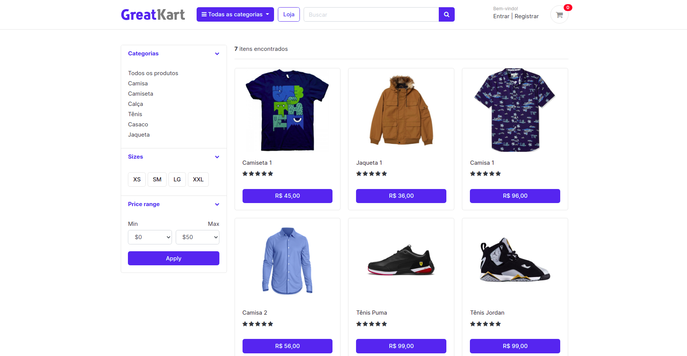
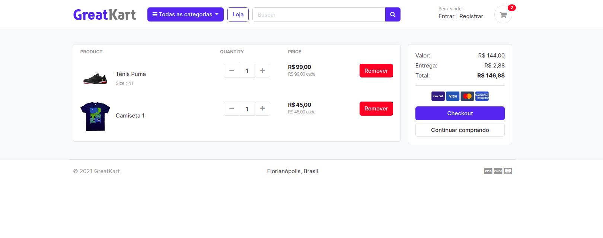
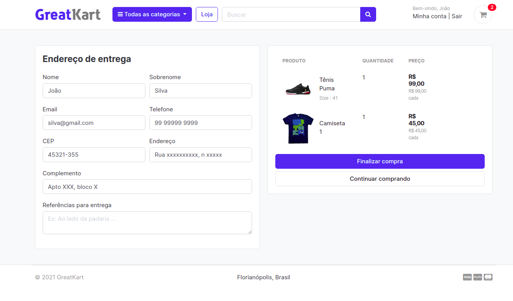
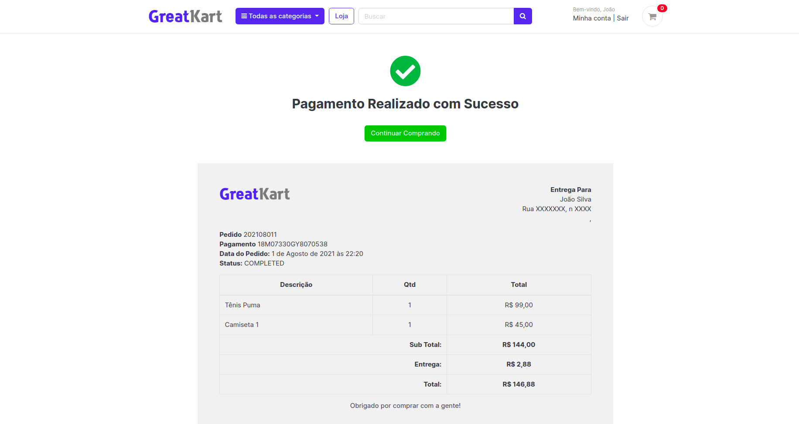

<p align="center">
    
</p>

<h1 align="center">Django Ecommerce Web App</h1>

<h1 align="center">
    <a href="https://https://www.djangoproject.com//">🔗 Django</a>
</h1>
<p align="center">🚀 Aplicação Web de um e-commerce genérico com back-end desenvolvido com o framework Django</p>

<p align="center">
    
    
</p>


<p align="center">
 <a href="#objetivo">Objetivo</a> •
 <a href="#como-utilizar">Como utilizar</a> • 
 <a href="#sreenshots">Sreenshots</a> • 
 <a href="#licenca">Licença</a> • 
 <a href="#autor">Autor</a>
</p>

# Objetivo

Esta aplicação tem como objetivo explorar alguns dos principais recursos do framework Django, implementando uma e-commerce com algumas características:

- Cadastro de usuário
- Cadastro de cliente
- Cadastro de produtos
    - Descrição
    - Categoria
    - Variações (tamanho e cor)
    - Quantidade em estoque
- Avalição de produtos
- Pagamento integrado com Paypal

A Aplicação foi desenvolvida com base em um [curso na Udemy](https://www.udemy.com/course/django-ecommerce-project-based-course-python-django-web-development/) com alguns recursos extras. 

## Como utilizar

Para utilizar a aplicação, clone o repositório, instale os pacotes necessários e inicie a aplicação:

```shell
pip install requirements.txt
```

```shell
python manage.py runserver
```

Acesse a url da aplicação:

```
127.0.0.1:8000/
```

Para criar um adminstrador e poder acessar as opções de admininstrador, execute o seguinte comando no terminal e siga a instruções que serão impressas:

```shell
python manage.py createsuperuser
```
Após o perfil de adminstrador ter sido criado, acesso o seguinte URL para poder acessar os recursos de admininstrador:

```
127.0.0.1:8000/secure_login/
```

Nesta página, você poderá criar categorias de produtos, criar/remover pordutos e muito mais.


## Sreenshots

Página principal da loja:

<p align="center">
    
</p>

Detalhes do produto:
<p align="center">
    
</p>

Carrinho de compras:
<p align="center">
    
</p>

Endereço de entrega:
<p align="center">
    
</p>

Pedido realizado:
<p align="center">
    
</p>

## Licença

MIT © Rafael Hiller

## Autor

Feito por Rafael Hiller.

[](https://www.linkedin.com/in/rafael-hiller-0aa187133/) 
